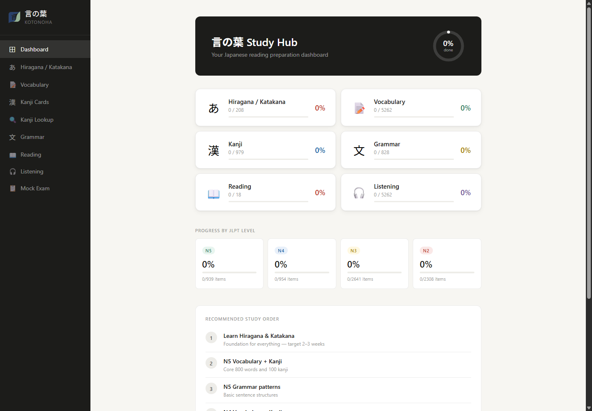
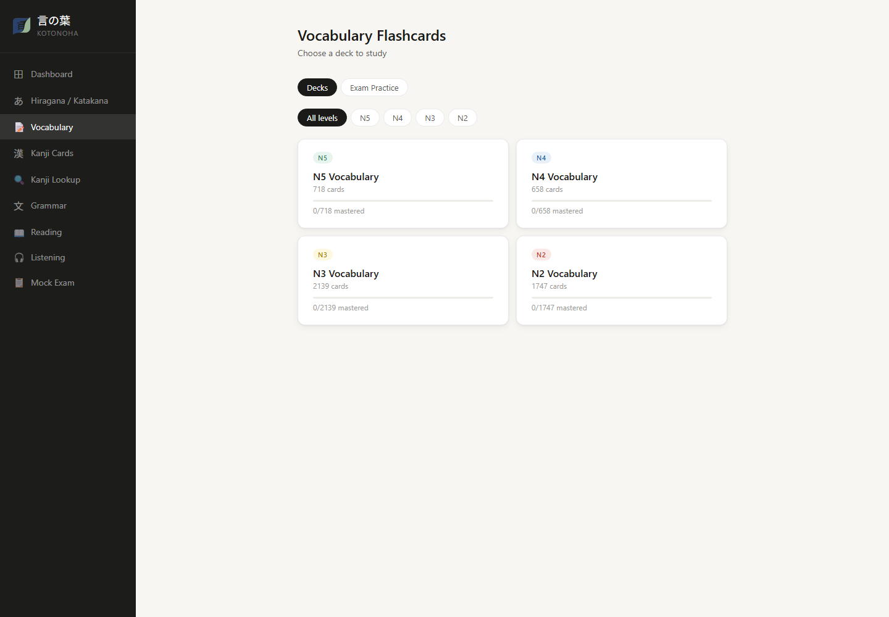
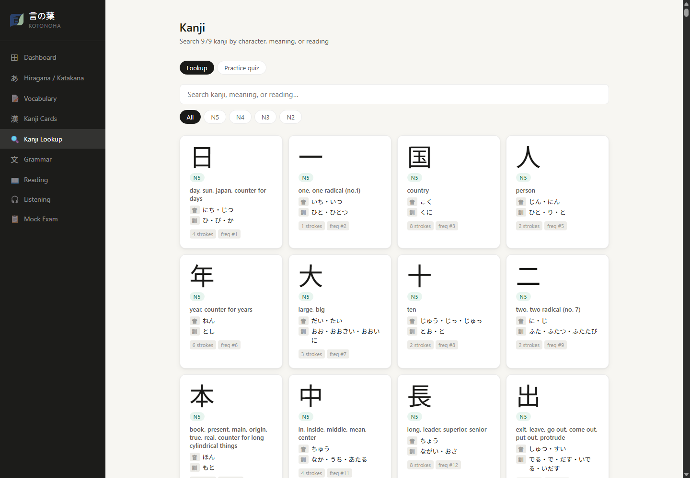
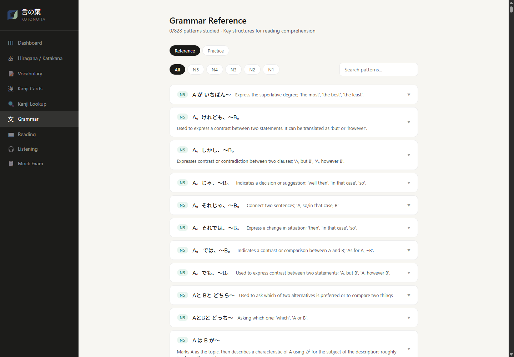
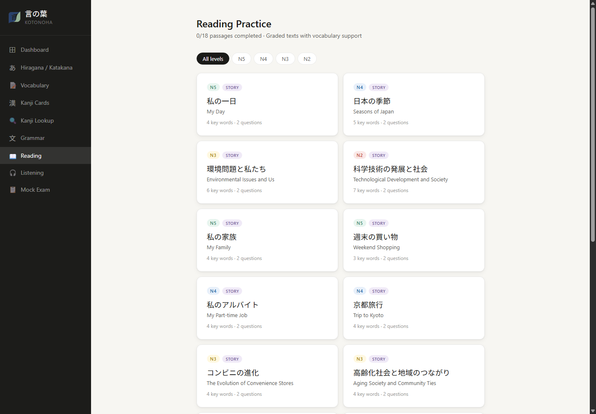
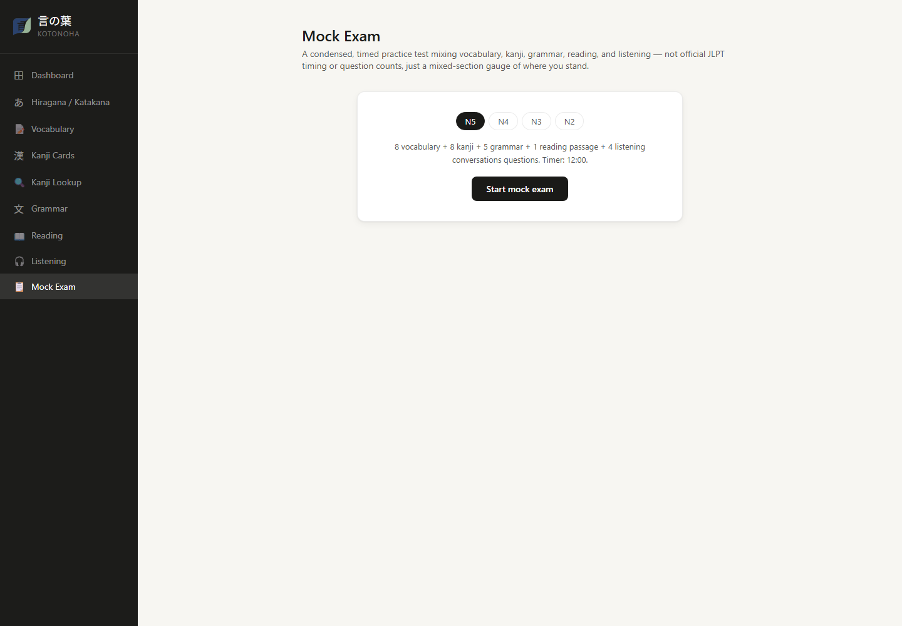

<p align="center">
  
</p>

# 言の葉 Kotonoha

A personal Japanese study app built for JLPT-style reading preparation (roughly N5 → N2). It bundles kana drills, vocabulary/kanji flashcards with real spaced repetition, a grammar reference, graded reading passages, listening practice, and a mixed-section mock exam into one local, no-account, no-backend tool. All progress is saved in the browser via `localStorage` — nothing leaves your machine.

The name comes from 言の葉 (kotonoha, literally "leaves of words") — a classical, poetic way of referring to language/words in Japanese.

## Features

- **Dashboard** — an overview ring showing overall completion, per-module progress cards, a per-JLPT-level breakdown (N5–N2), a due-for-review banner, and a recommended study order roadmap that updates live as you study. Also where you export/import a progress backup.
- **Hiragana & Katakana** — the full gojūon tables (46 base characters, dakuten/handakuten, and all yōon combinations) for both scripts.
  - *Chart mode*: a reference grid, grouped the traditional way, with mastered characters highlighted.
  - *Practice mode*: a multiple-choice quiz scoped to Basic / Dakuten / Combinations / All, in rounds of up to 15 questions.
- **Vocabulary flashcards** — real JLPT word lists, not a hand-picked sample: **5,262 words** across N5–N2 (718/658/2139/1747 by level). See [Content data sources](#content-data-sources).
- **Kanji flashcards** — all **979 N5–N2 jōyō kanji** (79/166/367/367 per level), sourced from a real kanji database.
- Both flashcard modes share one flip-and-grade flow (Hard / Got it, keyboard shortcuts, a listen button per card) and a real **spaced-repetition schedule** — see [Spaced repetition](#spaced-repetition).
- **Kanji Lookup** — a searchable reference of all 979 kanji by character, meaning, or on'yomi/kun'yomi reading, with stroke count and frequency rank; also has its own multiple-choice **meaning-recall quiz** mode, scoped by level.
- **Vocabulary exam-format practice** — a second mode inside the Vocabulary tab, separate from flashcards: given a reading, pick the correct kanji spelling, or given a kanji word, pick the correct reading — mirroring the real JLPT 文字・語彙 question shapes rather than open flashcard recall. Auto-generated from the same verified vocab data, no new content to get wrong.
- **Grammar reference** — **828 JLPT grammar patterns, N5–N1**, each with an explanation, a formation rule, and two example sentences, filterable by level and searchable, with a "studied" checkbox per pattern. N5/N4 (260 entries) were individually fact-checked against real Japanese grammar knowledge and corrected where wrong; N3/N2/N1 (568 entries) are flagged **⚠ unverified** in the UI itself. See [Content data sources](#content-data-sources).
- **Grammar practice** — two quiz modes (N5/N4 only, scoped to the fact-checked set): *fill-in-the-blank*, mechanically generated by extracting each pattern's literal fragment out of its own verified example sentence (110 questions, no separate authoring — see [Content data sources](#content-data-sources)); and *sentence order*, matching the real 文法整序 format (a sentence split into 4 pieces, pick which one goes in the ★ position), hand-authored and checked (20 sentences).
- **Reading practice** — **18 passages**: 12 graded narrative passages (3 per level, N5–N2) plus 6 short document-style passages (N5/N4) — notices, flyers, schedule changes — matching the real exam's short-realistic-document reading task, which reads very differently from a story. Both have hoverable inline vocabulary glossing, a **furigana toggle**, a listen button, and multiple-choice comprehension questions.
- **Listening practice** — two modes. *Vocabulary*: your browser's built-in Japanese text-to-speech speaks a word, pick the meaning you heard. *Conversations*: short dialogues (hand-authored, 16 total across N5/N4) read aloud, then a task/point-comprehension question — closer to the real listening section's format than isolated-word recognition, with a speaker-labeled transcript revealed after answering. No audio files, no API keys — just whatever Japanese voice your OS/browser already has; the whole Listening section hides itself if none is available.
- **Mock Exam** — a condensed, timed practice test mixing vocabulary, kanji, grammar (which-pattern-is-this-sentence), reading comprehension, and listening into one scored run, scoped by level. The listening section uses the same task-comprehension conversations as the standalone Listening mode at N5/N4 (with a transcript reveal after answering), falling back to word-recognition at N3/N2 where no dialogues exist yet; hides itself entirely if no Japanese voice is available. Not official JLPT timing or question counts — a mixed-section gauge of where you stand, not a simulation of the real test.

All progress (flashcard grades + SRS schedule, studied grammar, completed readings, mastered kana/kanji) persists locally and feeds the Dashboard's completion stats.

## Screenshots

| Dashboard | Vocabulary |
|---|---|
|  |  |

| Kanji Lookup | Grammar |
|---|---|
|  |  |

| Reading | Mock Exam |
|---|---|
|  |  |

## Tech stack

- [React 18](https://react.dev/) + [Vite 5](https://vitejs.dev/) for the app shell and dev/build tooling
- [Zustand](https://github.com/pmndrs/zustand) (with its `persist` middleware) for state management and `localStorage` persistence
- The browser's native [Web Speech API](https://developer.mozilla.org/en-US/docs/Web/API/Web_Speech_API) (`speechSynthesis`) for listening practice — no external TTS service
- Plain CSS Modules per component, no UI framework or CSS-in-JS

## Getting started

Requires Node.js (18+ recommended).

```bash
npm install
npm run dev
```

Then open the URL Vite prints (typically `http://localhost:5173`).

### Other scripts

```bash
npm run build     # production build to dist/
npm run preview   # serve the production build locally
```

## Project structure

```
src/
  App.jsx                      # shell: sidebar nav + view routing
  main.jsx                     # React entry point
  assets/
    logo-icon.png                # cropped, transparent-bg app icon (sidebar); favicons in public/ are generated from it
  lib/
    speech.js                   # Web Speech API wrapper (listening practice, speak buttons)
  store/
    useStore.js                  # Zustand store: view state, flashcard sessions, SRS, all progress
  data/
    content.js                   # reading passages; re-exports vocab/kanji/grammar data
    vocabData.js                  # AUTO-GENERATED vocab decks + flat list — see "Content data sources"
    kanjiData.js                   # AUTO-GENERATED kanji decks + lookup DB
    grammarData.js                  # AUTO-GENERATED grammar patterns (N5/N4 fact-checked, N3-N1 not)
    grammarExercises.js              # fill-in-the-blank pool, mechanically extracted from grammarData.js
    sentenceOrder.js                  # hand-authored 文法整序 (sentence order) practice sentences
    listeningConversations.js          # hand-authored task-based listening dialogues
    kanaRomaji.js                       # hiragana/katakana -> romaji conversion (used by the generators)
    kana.js                              # hiragana/katakana tables
  components/
    dashboard/                       # progress overview, due-review banner, backup export/import
    kana/                              # hiragana/katakana chart + quiz
    flashcards/                        # flip-card view (vocab + kanji decks, SRS review) + vocab exam-format practice
    kanji/                              # kanji lookup/search + meaning-recall quiz
    grammar/                             # grammar reference + fill-in-blank/sentence-order practice
    reading/                              # reading passages, furigana toggle, comprehension checks
    listening/                             # vocabulary listening quiz + conversation listening practice
    exam/                                   # mock exam (mixed sections, timed, scored)
    shared/
      SpeakButton.jsx                        # reusable 🔊 button, self-hides if no JP voice found
  styles/
    global.css                    # shared tokens, layout, and primitives (buttons, badges, pills, cards)
public/
  logo.png                    # original source logo (README header) — not imported by app code
  favicon*.png, apple-touch-icon.png   # generated from src/assets/logo-icon.png, see index.html
  screenshots/                 # README screenshots
scripts/
  generate-vocab-data.mjs      # regenerates src/data/vocabData.js from source data
  generate-kanji-data.mjs      # regenerates src/data/kanjiData.js from source data
  generate-grammar-data.mjs    # regenerates src/data/grammarData.js from source data + corrections
```

Each feature area is a self-contained folder with its own `.jsx` and CSS Module — the only shared component is `SpeakButton`. Shared primitives live in `global.css` (`.btn-primary`, `.badge`, `.pill`, `.card`, etc.) and the `.jp` class for Japanese-script text (rendered in Noto Sans JP).

## Content data sources

Vocabulary and kanji are **generated from real, sourced datasets**, not hand-typed — this matters for a study app, since a hand-typed word list is only as good as one person's memory and typing accuracy.

**Kanji** (`scripts/generate-kanji-data.mjs` → `src/data/kanjiData.js`), 979 kanji, N5–N2:
- **[KANJIDIC2](http://www.edrdg.org/wiki/index.php/KANJIDIC_Project)** (Electronic Dictionary Research and Development Group, CC BY-SA 4.0) — readings, meanings, stroke counts, grade levels.
- **[Jonathan Waller's JLPT Resources](http://www.tanos.co.uk/jlpt/)** — the standard unofficial JLPT-level-per-kanji mapping (the JLPT itself hasn't published an official kanji list since 2010).
- Repackaged as JSON by **[davidluzgouveia/kanji-data](https://github.com/davidluzgouveia/kanji-data)** (MIT), which the generator fetches directly.

**Vocabulary** (`scripts/generate-vocab-data.mjs` → `src/data/vocabData.js`), 5,262 words, N5–N2:
- **[elzup/jlpt-word-list](https://github.com/elzup/jlpt-word-list)** (MIT) — per-level JLPT vocabulary lists (expression, reading, meaning).
- The generator also cleans a small fraction of source rows where the reading column had stray annotations baked in (e.g. `"(〜を) とお"`, `"いい; よい"`) and drops any row it can't clean into a plain kana reading, rather than shipping a garbled one.

Romaji for both is derived **deterministically from the kana reading** via `src/data/kanaRomaji.js` (shared by both generators, and by the Hiragana/Katakana module's own romaji table) — not a separate hand-maintained romanization that could drift out of sync.

**Grammar** (`scripts/generate-grammar-data.mjs` → `src/data/grammarData.js`), 828 patterns, N5–N1 (136/124/132/191/245):
- **[tristcoil/hanabira.org](https://github.com/tristcoil/hanabira.org)** (MIT) — a structured JLPT grammar database (pattern, explanation, formation rule, 4 example sentences per entry, tagged by level).
- Unlike the KANJIDIC/JLPT-word-list sources above, this one is **LLM-generated** (the same repo's own data directory has files literally named `*_openai_*`), which is a materially different trust level — it's a plausible-sounding draft, not a reference. Every N5 and N4 entry (260 total) was individually read and checked against real Japanese grammar knowledge before inclusion; **8 confirmed errors were found and corrected** — e.g. an example for `～みたいだ` that inserted an ungrammatical の (`病気のみたいだ` instead of `病気みたいだ`), and a `てある` example built on an intransitive verb it can't grammatically attach to. Corrections live in the `CORRECTIONS` map at the top of the generator script, keyed by source index, so re-running the script re-applies them.
- **N3/N2/N1 (568 entries) were not individually verified.** A spot-check of the N1 set alone (outside the fact-checked N5/N4 scope) turned up an entry glossing `の嫌いがある` as "have a dislike for" when it actually means "has a tendency toward" — a real trap, since 嫌い alone does mean "dislike." That entry was left uncorrected (it's out of the scope that got fixed) as a concrete illustration of the risk in the untouched N3–N1 set. Given the ~3% error rate found in the checked set, assume some N3–N1 entries have similar mistakes. Each entry carries a `verified: true/false` field reflecting this, and the Grammar view shows an **⚠ unverified** badge on every N3–N1 entry so it's visible in the app itself, not just in this file. Treat those as a study aid to cross-reference elsewhere, not a source of truth on their own.

Romaji for vocab/kanji is derived **deterministically from the kana reading** via `src/data/kanaRomaji.js` (shared by both generators, and by the Hiragana/Katakana module's own romaji table) — not a separate hand-maintained romanization that could drift out of sync.

To refresh any dataset from upstream:

```bash
node scripts/generate-vocab-data.mjs
node scripts/generate-kanji-data.mjs
node scripts/generate-grammar-data.mjs
```

All three rewrite their output file in place — don't hand-edit `vocabData.js`, `kanjiData.js`, or `grammarData.js`. To include N1 in the kanji set, change the `LEVELS` array at the top of `generate-kanji-data.mjs`. If you re-run the grammar generator after the upstream source changes, double-check the `CORRECTIONS` map's indices still point at the entries they're meant to — they're keyed by array position, which shifts if upstream reorders or adds entries above a corrected one.

**Reading passages** (`src/data/content.js`, `READING_PASSAGES`) are hand-written — 18 total: 12 narrative passages (3 per level, N5–N2) plus 6 short document-style ones (notices/flyers/schedule changes, N5/N4, `format: 'notice'`). No usable open dataset exists for these: the same hanabira.org repo has AI-generated reading passages (10 tagged N3, 2 more tagged N2), but they read as generic AI short fiction with vocabulary far denser than their level tag suggests (the N2-tagged ones use words like 太陽系外惑星 "exoplanet") and there's no N5/N4/N1 coverage at all. Real graded readers (NHK Easy News, Tadoku, textbook passages) are copyrighted, not open datasets. Tatoeba's sentence corpus is real and CC-licensed, but it's disconnected sentence pairs, not passages with narrative coherence. Each hand-written passage's vocabulary glossary was cross-checked against the app's own verified vocab data (`VOCAB_ALL`) for reading consistency where the word overlaps, and every glossary entry is verified to literally appear in its passage's text (so the hover-highlight feature actually finds it).

**Grammar practice content** has two different provenances, worth keeping straight:
- `src/data/grammarExercises.js` (fill-in-the-blank) is **not separately authored** — it's a pure function over the already-verified N5/N4 entries in `grammarData.js`: strip the English placeholder labels (Verb/Noun/Adjective/A/B) and tildes from a pattern's name, and if what's left is one unambiguous multi-character Japanese fragment that occurs exactly once in one of that pattern's own example sentences, it becomes a question. Multi-slot templates (e.g. `AはBが〜`, which has two separate literal pieces) are skipped rather than guessed at. Since it's derived from data already fact-checked, there's nothing new here to get wrong.
- `src/data/sentenceOrder.js` (sentence order) and `src/data/listeningConversations.js` (conversation listening) **are** separately hand-authored — 20 and 16 items respectively — because no dataset of correctly-chunked JLPT-style sentences or task-based dialogue scripts exists to source from. Each was individually checked for grammaticality before inclusion, same standard as the grammar corrections above.

### Furigana accuracy note

The Reading Practice furigana toggle intentionally only annotates words from each passage's own hand-verified vocabulary glossary — it does **not** fall back to the full vocab dataset for full-sentence coverage. An earlier version tried that and broke on real text: word-list lookup with no grammatical context can't tell that e.g. 一月 means "January" in one sentence and "one month" in another, and a naive tokenizer matched it *inside* 十一月 ("November"), producing a misleading reading. Scoping to the curated glossary trades coverage for guaranteed-correct readings.

## Adding content

Reading passages live in `src/data/content.js` — there's no CMS or database. To add one, add an entry to the `READING_PASSAGES` array following the shape of its neighbors; each item needs a unique `id` since progress is tracked by id in the Zustand store. Vocabulary, kanji, and grammar should go through their generator scripts rather than being added by hand, to keep content verified against a real source rather than one-off typing. If you hand-fix a specific grammar entry, add it to the `CORRECTIONS` map in `generate-grammar-data.mjs` (not a direct edit to `grammarData.js`) so the fix survives regeneration.

## Spaced repetition

Vocabulary and kanji flashcards use a Leitner-box schedule (`src/store/useStore.js`): grading a card "Got it" advances it to the next of 5 boxes (review intervals of 1/1/2/4/8/16 days); grading it "Hard" resets it to box 1. This is separate from the in-session reshuffling (which just brings hard cards back around sooner within the same sitting) — it's what makes the Dashboard's "N cards due for review" banner and the per-deck "Review due cards" prompt meaningful over days/weeks, not just within one sitting.

## Backup / resetting progress

Progress is stored under the `jp-study-v1` key in `localStorage` — it never leaves your machine, which also means clearing browser data deletes it. Use the **Export**/**Import** buttons on the Dashboard to back up or restore progress as a JSON file. The store also exposes a `resetProgress()` action (not currently wired to a UI button) that clears everything — or you can clear the `jp-study-v1` key directly from your browser's dev tools.
